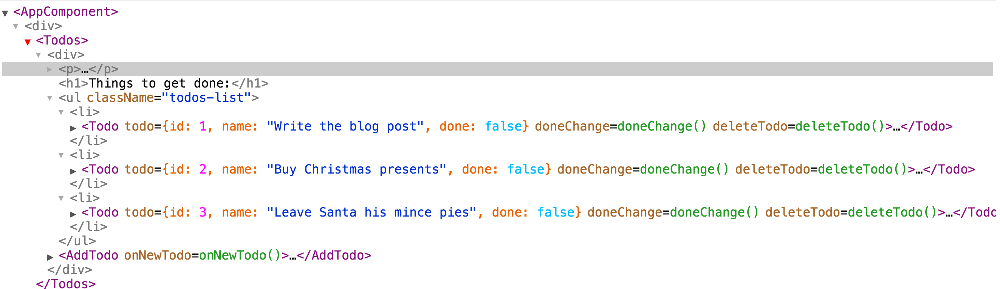
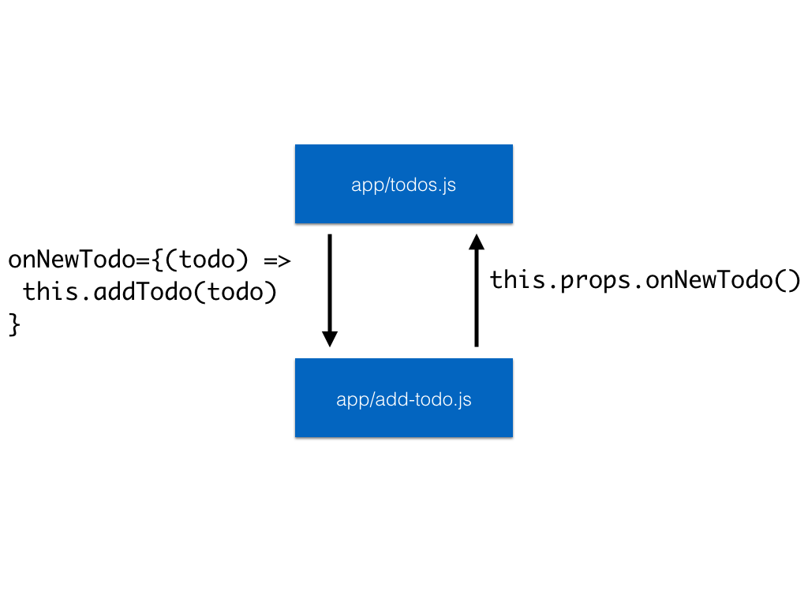
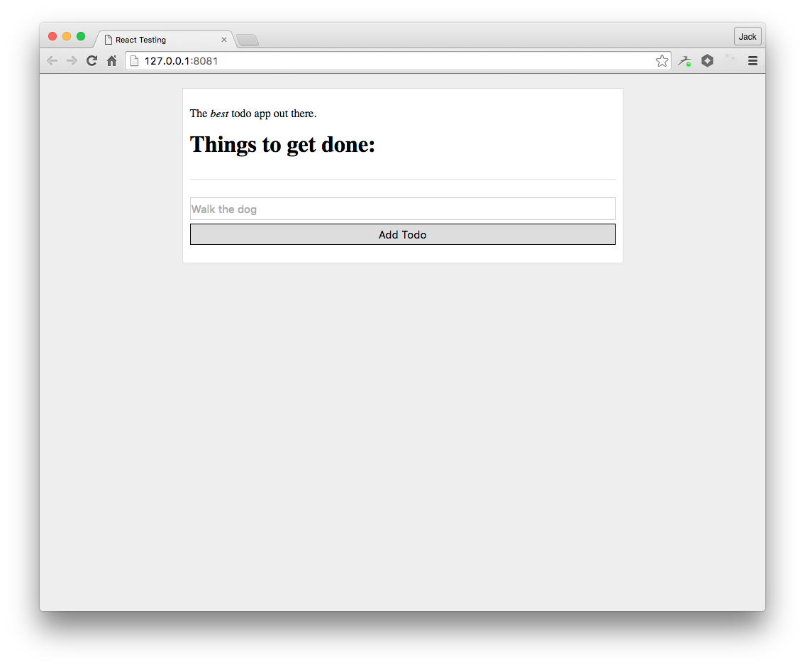
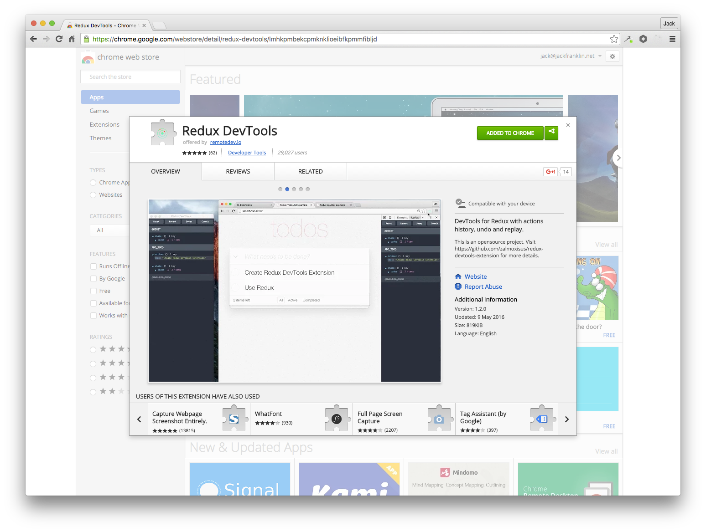
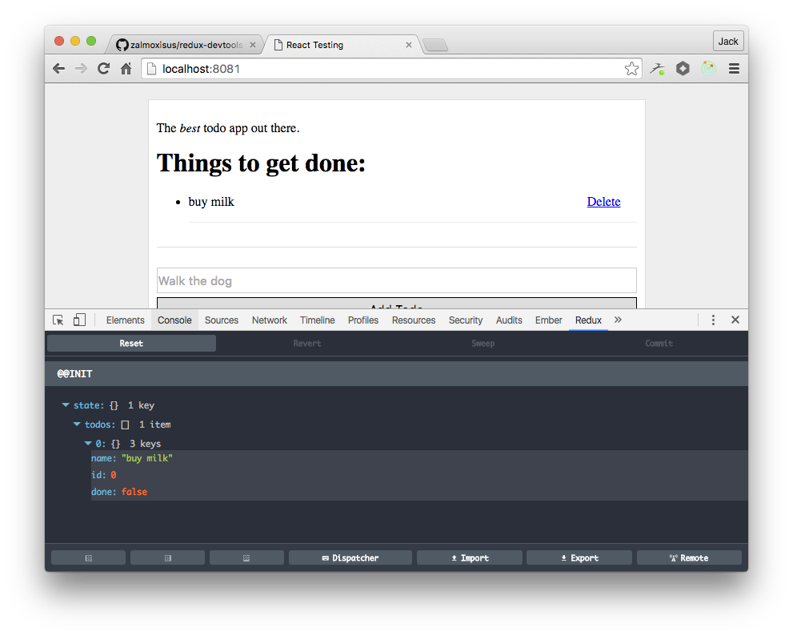

slidenumbers: true

# Managing Data with React and Redux

---

## @Jack_Franklin
## @pusher


---


---



---

# In the beginning

---


app/todos.js

```js
export default class Todos extends React.Component {
  constructor(props) {
    super(props);
    this.state = {
      todos: [
        { id: 1, name: 'Write the blog post', done: false },
        { id: 2, name: 'Buy Christmas presents', done: false },
        { id: 3, name: 'Leave Santa his mince pies', done: false },
      ]
    }
  }
  ...
}
```

---

app/todos.js

```js
render() {
  return (
    <div>
      <p>The <em>best</em> todo app out there.</p>
      <h1>Things to get done:</h1>
      <ul className="todos-list">{ this.renderTodos() }</ul>
      <AddTodo onNewTodo={(todo) => this.addTodo(todo)} />
    </div>
  )
}
```

---

```js
<AddTodo onNewTodo={(todo) => this.addTodo(todo)} />
```



---

Parent component contains all state.

Child components are given functions to call to tell the parent component of the new state.

---

`app/todos.js` contained the logic for updating the state from some user input.

```js
constructor(props) {...}

addTodo(todo) {
  const newTodos = this.state.todos.concat([todo]);
  this.setState({ todos: newTodos });
}

...

render() {...}
```


---

But then as this component grew I pulled out the business logic into standalone JavaScript functions:

---

app/todos.js

```js
constructor(props) {...}

addTodo(todo) {
  this.setState(addTodo(this.state, todo));
}

...

render() {...}
```

---

State functions can take the current state and produce a new state.

```js
export function deleteTodo(state, id) {
  return {
    todos: state.todos.filter((todo) => todo.id !== id)
  };
}
```

---

This is effectively a very, very basic Redux (but worse in many ways!).

---

This is fine for small applications, but it tightly couples components and makes refactoring or restructuring components trick and makes refactoring or restructuring components tricky.

---

The more data you have, the more difficult it is to manage as different components can edit different pieces of data.

---

If you split the data up across components, you no longer have a single source of truth for your application's data.

---

It's tricky to track down what caused the data to change, and where it happened.

```
grep setState
```

---

As your application grows you need some process and structure around your data.

---

But don't use Redux by default! For smaller apps you'll probably find yourself quite content without.

---

# Redux

---

# The three principles of Redux.

- Single Source of Truth: all data is stored in one object.
- State is read only: nothing can directly mutate the state.
- The state is manipulated by pure functions: no external data can affect them.

---

# Building a Redux application

---

```javascript
import { createStore } from 'redux';

function counter(state, action) {
  ...
}

const store = createStore(counter);

console.log('Current state', store.getState());

```

---

- __store__: the object that holds our state
- __action__: an object sent to the store in order to manipulate the store's data
- __reducer__: a function that takes the current state, an action and produces the new state.

---

First: define your actions.

```javascript
{ type: 'INCREMENT' }

{ type: 'DECREMENT' }
```

---

Second: define how your reducer should deal with those actions:

```js
function counter(state, action) {
  switch (action.type) {
    case 'INCREMENT': 
      return state + 1;
    case 'DECREMENT':
      return state - 1;
    default:
      return state;
  }
}
```
---

Third: define what to do if you don't have any state:

```js
function counter(state, action) {
  if (!state) state = 0;
  ...
}

// OR
function counter(state = 0, action) {
  ...
}
```

---

Fourth: create your store and __dispatch__ some actions:

```js
const store = createStore(counter);

store.dispatch({ type: 'INCREMENT' });

console.log('Current state', store.getState());
// => 1
```
---

# What makes this good?

- The main logic is contained in a function, abstracted away from the store. It's easy to modify, follow and test.
- Nothing ever manipulates the state, all manipulation is done via actions.
- Actions are just plain objects; they can be logged, serialised, repeated, and so on.
- Our reducer is pure - the state is never directly mutated.


---

# Adding Redux to a React application

```
npm install --save redux react-redux
```

---

First, let's decide what our state will look like:

```js
{
  todos: [
    { id: 1, name: 'buy milk', done: false },
    ...
  ]
}
```

---

Secondly, let's define the actions.

- `{ type: 'ADD_TODO', name: '...' }`
- `{ type: 'DELETE_TODO', id: ... }`
- `{ type: 'TOGGLE_TODO', id: ... }`

---

Thirdly, let's define the reducer function that will deal with these actions.

```js
export default function todoAppReducers(
  state = { todos: [] },
  action
) {
  ...
};
```

---

We can first deal with `ADD_TODO`:

```js
switch (action.type) {
  case 'ADD_TODO':
    const todo = {
      name: action.name,
      id: state.todos.length,
      done: false
    }

    return {
      todos: state.todos.concat([todo])
    }
}
```
---

And then `DELETE_TODO`:

```js
case 'DELETE_TODO':
  return {
    todos: state.todos.filter((todo) => todo.id !== action.id)
  }
```

---

And finally `TOGGLE_TODO`:

```js
case 'TOGGLE_TODO':
  const todos = state.todos.map((todo) => {
    if (todo.id === action.id) {
      todo.done = !todo.done;
    }

    return todo;
  });

  return { todos };
```

---

We've just modelled most of our business logic without having to deal with UI interactions or anything else.

This is one of the biggest pluses to using Redux.

---

Now let's create a store and connect our components.

---

By default a component __does not__ have access to the store. 

Components that do are known as "smart" components.

Components that do not are known as "dumb" components.

---

app/index.js

```js
import React from 'react';
import { render } from 'react-dom';
import Todos from './todos';

class AppComponent extends React.Component {
  render() {
    return <Todos />;
  }
}

render(
  <AppComponent />,
  document.getElementById('app')
);
```

---

We'll firstly create a store and __connect__ our application.

```js
// other imports skipped
import { Provider } from 'react-redux';
import { createStore } from 'redux';
import todoAppReducers from './reducers';

const store = createStore(todoAppReducers);

class AppComponent extends React.Component {...}

render(
  <Provider store={store}>
    <AppComponent />
  </Provider>,
  document.getElementById('app')
);
```

---

All the `Provider` does is make components in our application able to connect to the store if we give them permission.

You only need to wrap your top level component in the `Provider`, and once it's done you can mostly forget about it.

---

We now have a store and our top level component has been given access to it.

Now we need to give our components access to the store so they can render the data to it.

---

The `Todos` component needs access to the todos in the store so it can render the individual todos.

We can use the `connect` function from react-redux to do this.

---

app/todos.js

```js
import { connect } from 'react-redux';

class Todos extends React.Components {...};

const ConnectedTodos = connect((state) => {
  return {
    todos: state.todos
  }
})(Todos);
```

---

The `connect` function takes a React component and produces a new component that will be given access to parts of the state as props.

This lets us strictly control which parts of our state each component has access to.

It also provides `this.props.dispatch`, which is used to dispatch actions, which we'll see later.

---

So now within our `Todos` component we can swap `this.state.todos` to `this.props.todos`.

We can also get rid of all the functions for managing state, and stop passing them through to child components.


---

```js
class Todos extends React.Component {
  renderTodos() {
    return this.props.todos.map((todo) => {
      return <li key={todo.id}><Todo todo={todo} /></li>;
    });
  }

  render() {
    return (
      <div>
        <ul className="todos-list">{ this.renderTodos() }</ul>
        <AddTodo />
      </div>
    )
  }
}
```

---

Notice how much cleaner this is, and how our component is purely focused on presentation.

---

Now let's hook up `AddTodo` so we can create new todos.



---

`AddTodo` doesn't need to access any data in the store but it does need to dispatch actions, so it too must be connected.

```js
class AddTodo extends React.Component {...};

const ConnectedAddTodo = connect()(AddTodo);

export default ConnectedAddTodo;
```

---

The old `addTodo` method:

```js
addTodo(e) {
  e.preventDefault();
  const newTodoName = this.refs.todoTitle.value;
  if (newTodoName) {
    this.props.onNewTodo({
      name: newTodoName
    });

    this.refs.todoTitle.value = '';
  }
}
```

---

The new one:

```javascript
addTodo(e) {
  e.preventDefault();
  const newTodoName = this.refs.todoTitle.value;
  if (newTodoName) {
    this.props.dispatch({
      name: newTodoName,
      type: 'ADD_TODO'
    });
    ...
  }
}
```

---

And we're now using Redux to add Todos!


---

Finally, we can update the `Todo` component to dispatch the right actions for toggling and deleting.

---

```js
toggleDone() {
  this.props.dispatch({
    type: 'TOGGLE_TODO',
    id: this.props.todo.id
  });
}

deleteTodo(e) {
  this.props.dispatch({
    type: 'DELETE_TODO',
    id: this.props.todo.id
  });
}
```

---

But there's a problem!


---

# Mutation!
---

Redux expects you to never mutate anything, and if you do it can't always correctly keep your UI in sync with the state.

We've accidentally mutated...

---


In our reducer...

```js
case 'TOGGLE_TODO':
  const todos = state.todos.map((todo) => {
    if (todo.id === action.id) {
      todo.done = !todo.done;
    }

    return todo;
  });

  return { todos };
```

---

```js
todo.done = !todo.done;
```

---

A quick rewrite...

```js
case 'TOGGLE_TODO':
  const todos = state.todos.map((todo) => {
    if (todo.id === action.id) {
      return {
        name: todo.name,
        id: todo.id,
        done: !todo.done
      }
    }

    return todo;
  });
```

---

And it all works, as does deleting a todo. We're fully Reduxed!

---

# Deep breath...

---

That probably felt like a lot of effort, but the good news is once you've set Redux up you are set.

---

1. Decide the shape of your state.
2. Decide the actions that can update the state.
3. Define your reduceers that deal with actions.
4. Wire up your UI to dispatch actions.
5. Connect your components to the store to allow them to render state.

---

# Still to come

1. Debugging Redux
2. Better Redux Reducers
3. Middlewares
4. Async actions

---



---

If you're not using Chrome you can still use the devtools but it takes a bit more effort. 

See: https://github.com/gaearon/redux-devtools

---

Firstly, install the plugin in Chrome.

---

Secondly, update the call to `createStore`:

```js
createStore(reducers, initialState, enhancer).
```

Enhancer: a function that enhances the store with middleware or additional functionality. We'll see this again later.

---

```js
const store = createStore(
  todoAppReducers,
  undefined,
  window.devToolsExtension ? window.devToolsExtension() : undefined
);
```

We leave the `initialState` as undefined because our reducer deals with no state.

---



---


---


---

# Better Reducers

---

Imagine our TODO app now needs to have a user log in first, and our state will now keep track of the user that's logged in.

---

Our new state will look like:

```js
{
  todos: [
    { id: 1, name: 'buy milk', done: false },
    ...
  ],
  user: {
    id: 123,
    name: 'Jack'
  }
}

```

---

Next, let's define some new actions:

```js
{ type: 'LOG_USER_IN', id: ..., name: '...' }
{ type: 'LOG_USER_OUT' }
```

---

And then our reducer needs to be updated. Firstly, now we have two keys in our state, we should update the reducers we have to not lose any keys they don't deal with.

---

Before:

```js
case 'DELETE_TODO':
  return {
    todos: state.todos.filter((todo) => todo.id !== action.id)
  }
```

After:

```js
case 'DELETE_TODO':
  return Object.assign({}, state, {
    todos: state.todos.filter((todo) => todo.id !== action.id)
  });
```

---

And now we can add reducers for the new user actions:

```js
case 'LOG_USER_IN':
  return Object.assign({}, state, {
    user: { id: action.id, name: action.name }
  });

case 'LOG_USER_OUT':
  return Object.assign({}, state, {
    user: undefined
  });
```

---

```js
export default function todoAppReducers(
  state = { todos: [initialTodo], user: undefined },
  action
) {
  switch (action.type) {
    case 'ADD_TODO':
      const todo = {
        name: action.name,
        id: state.todos.length,
        done: false
      }

      return Object.assign({}, state, {
        todos: state.todos.concat([todo])
      });

    case 'DELETE_TODO':
      return Object.assign({}, state, {
        todos: state.todos.filter((todo) => todo.id !== action.id)
      });

    case 'TOGGLE_TODO':
      const todos = state.todos.map((todo) => {
        if (todo.id === action.id) {
          return {
            name: todo.name,
            id: todo.id,
            done: !todo.done
          }
        }

        return todo;
      });

      return Object.assign({}, state, { todos });

    case 'LOG_USER_IN':
      return Object.assign({}, state, {
        user: { id: action.id, name: action.name }
      });

    case 'LOG_USER_OUT':
      return Object.assign({}, state, {
        user: undefined
      });

    default:
      return state;

  }
};
```

---

Our reducer is huge, and deals with two different data sets:

- User
- Todos

In a larger app this will quickly become impossible to manage.

---

Instead we split into multiple reducers who are each resopnsible for a specific key in the state.

Each of these reducers is __only given their part of the state__.

---

```js
function userReducer(user, action) {
  switch (action.type) {
    case 'LOG_USER_IN':
      return {
        id: action.id,
        name: action.name
      }
    case 'LOG_USER_OUT':
      return undefined;

    default:
      return user;
  }
}
```

---

```js
function todoReducer(todos = [], action) {
  switch (action.type) {
    case 'ADD_TODO':
      ...

    case 'DELETE_TODO':
      return todos.filter((todo) => todo.id !== action.id);

    case 'TOGGLE_TODO':
      ...

    default:
      return todos;
  }
}
```

---

And our main reducer function becomes:

```js
export default function todoAppReducers(state = {}, action) {
  return {
    todos: todoReducer(state.todos, action),
    user: userReducer(state.user, action)
  }
};
```

---
